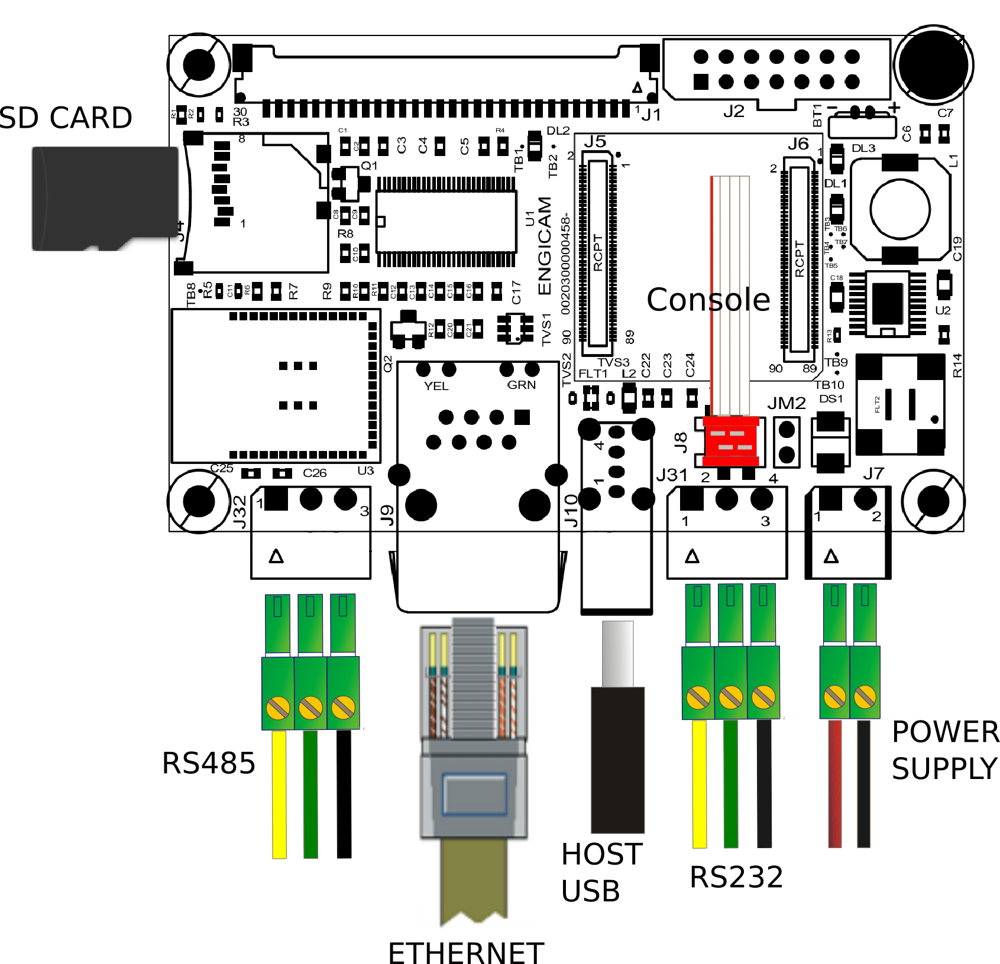
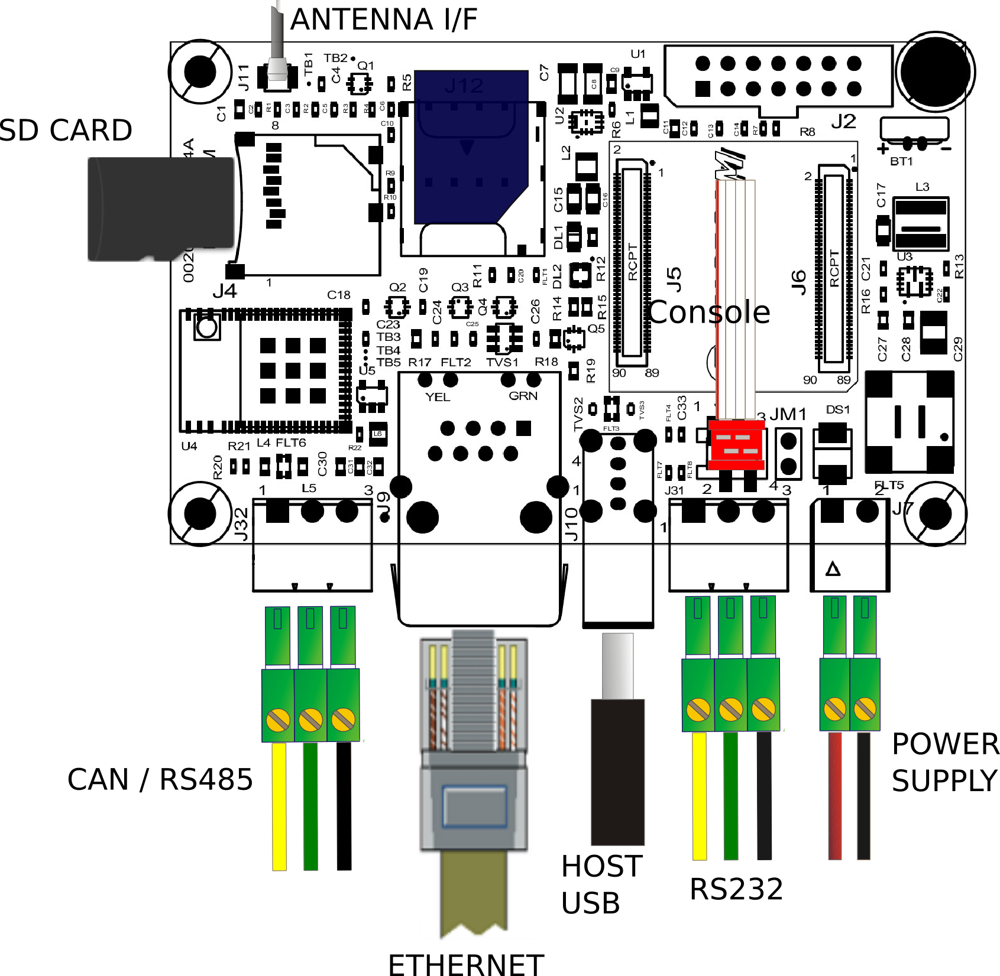

# Test sheet MicroGea MX6ULL

## Test sheet

## Version: 1.0

## Preliminary

Creation of engicam-evaluation-image-mx6ull image for sdcard booting and same image for nand programming.

--------------------------------------------------------------------------------------------------------

## Board Type: Microdev 2.0 (left image), Microdev Rev 3 (right image)

## SOM Type: Microgea MX6ULL

{width=45%}
{width=45%}

--------------------------------------------------------------------------------------------------------

## U-boot tests

|                                       Test                                    | Status  |
|-------------------------------------------------------------------------------|---------|
| [Nand Enviroment saving](#nand-environment-saving)                            |   OK    |
| [Sdcard Enviroment saving](#sdcard-environment-saving)                        |   OK    |
| [Ethernet](#ethernet)                                                         |   OK    |
| [Boot from nand](#boot-from-nand)                                             |   OK    |
| [Boot from sdcard](#boot-from-sdcard)                                         |   OK    |
| [Nand flash Programming from ethernet](#nand-flash-programming-from-ethernet) |   OK    |
| [Linux Console](#linux-console)                                               |   OK    |

## Test Notes:

### Nand Environment saving

```bash
setenv serverip 192.168.2.93
saveenv
reset board
printenv serverip
```

### Sdcard environment saving

Close the connector JM1:

```bash
setenv serverip 192.168.2.93
saveenv
reset board
printenv serverip
```

### Ethernet

Once the serverip has been saved:

```bash
setenv ipaddr 192.168.2.70
ping 192.168.2.161
```

The output should be:

```bash
Using ethernet@2188000 device
host 192.168.2.161 is alive
```

### Boot from NAND

```bash
saveenv
```

The output should be:

```bash
Saving Environment to NAND...
Erasing NAND...
Erasing at 0x1c0000 -- 100% complete.
Writing to NAND... OK
```

### Boot from sdcard

Close the connector JM1:

```bash
saveenv
```

The output should be:

```bash
Saving Environment to MMC...
Writing to MMC(0)... done
```

### Nand flash programming from ethernet

```bash
tftp ker_dtb_fs.scr
so
```

--------------------------------------------------------------------------------------------------------

## Kernel Linux tests

| Status |              Test             | Note
|--------|-------------------------------|-----------------------------
|  OK    |            Ethernet           | see [note1](#note-1)
|  OK    |              USB              |
|  OK    |            MMC card           |
|  OK    |      UART 232 ttymxc4 J31     | see [note2](#note-2)
|  TBT   |      UART 485 ttymxc1 J32     | see [note3](#note-3)
|  OK    |         Linux Console J8      |
|  OK    |             WIFI              | see [note4](#note-4)
|  OK    |          BLUETOOTH            | see [note5](#note-5)
|  OK    |             UMTS              | see [note6](#note-6)
|  OK    |             RTC               | see [note7](#note-7)

## Only for Microdev 2.0

| Status |              Test             | Note
|--------|-------------------------------|-----------------------------
|  OK    |             LVDS              |
|  OK    |           Backlight           | see [note8](#note-8)
|  OK    |          Touchscreen          | see [note9](#note-9)

--------------------------------------------------------------------------------------------------------

## Note

### Note 1

```bash
ping -c4 10.24.0.1
PING 10.24.0.1 (10.24.0.1) 56(84) bytes of data.
64 bytes from 10.24.0.1: icmp_seq=1 ttl=254 time=41.0 ms
64 bytes from 10.24.0.1: icmp_seq=2 ttl=254 time=41.1 ms
64 bytes from 10.24.0.1: icmp_seq=3 ttl=254 time=40.9 ms
64 bytes from 10.24.0.1: icmp_seq=4 ttl=254 time=40.9 ms

--- 10.24.0.1 ping statistics ---
4 packets transmitted, 4 received, 0% packet loss, time 3005ms
rtt min/avg/max/mdev = 40.850/40.939/41.064/0.080 ms
```

### Note 2

Before launch the test_serial tool the dma's firmware must to be loaded from system.
The loading is made automaticaly after few seconds at the end of boot. 
When loading is done, the console shows the message below:

```bash
imx-sdma 20ec000.sdma: firmware found.
imx-sdma 20ec000.sdma: loaded firmware 3.6
```

Connect TX/RX PIN connector J31 to the UART 232 port
From terminal launch command:

```bash
test_serial ttymxc4
```

or

```bash
test_serial2 -d /dev/ttymxc4 -b 115200
```

Verify that the characters written from keyboard are echoed in terminal.

### Note 3

Before launch the test_serial tool the dma's firmware must to be loaded from system.
The loading is made automaticaly after few seconds at the end of boot. 
When loading is done, the console shows the message below:

```bash
imx-sdma 20ec000.sdma: firmware found.
imx-sdma 20ec000.sdma: loaded firmware 3.6
```

Tested with other RS485 device connected with command:

```bash
test_serial2 -d /dev/ttymxc1 -b 115200
```

### Note 4

Simple script for wifi testing:

```bash
ifconfig eth0 down
echo "nameserver 8.8.8.8" > /etc/resolv.conf
ifconfig wlan0 up
iw dev wlan0 scan | grep SSID
wpa_passphrase SSID password > /etc/wpa_supplicant.conf
wpa_supplicant -iwlan0 -Dnl80211 -c/etc/wpa_supplicant.conf -B
udhcpc -i wlan0
```

On walnascar wpa_supplicant 2.11 doen't work properly with brcmfmac driver.
If you want to use wpa_supplicant include the package:

```
    brcmfmac-fix \
```

in your image.

Alternatively you can use iwd. Remember to uncomment the line

```
WIRELESS_DAEMON = "iwd"
```

inside recipe `/recipes-core/packagegroups/packagegroup.bbappend`.

At first use type:

```bash
$ iwctl
[iwd]# device list
                           Devices
--------------------------------------------------------------------------------
  Name                  Address               Powered     Adapter     Mode
--------------------------------------------------------------------------------
  wlan0                 ff:ff:ff:ff:ff:ff     on          phy0        station

[iwd]# device wlan0 set-property Powered on
[iwd]# device phy0 set-property Powered on
[iwd]# station wlan0 scan
[iwd]# station wlan0 get-networks
                                 Available Networks
--------------------------------------------------------------------------------
    Network name                         Security                Signal
--------------------------------------------------------------------------------
>   <SSID>                               psk                     ****

[iwd]# station wlan0 connect SSID
...passphrase will be reqested...
[iwd]# quit
$ udhcpc -i wlan0
$ ping www.google.com
PING www.google.com (216.58.209.36) 56(84) bytes of data.
64 bytes from mil07s12-in-f4.1e100.net (216.58.209.36): icmp_seq=1 ttl=114 time=37.1 ms
64 bytes from mil07s12-in-f4.1e100.net (216.58.209.36): icmp_seq=2 ttl=114 time=44.4 ms
64 bytes from mil07s12-in-f4.1e100.net (216.58.209.36): icmp_seq=3 ttl=114 time=46.4 ms
64 bytes from mil07s12-in-f4.1e100.net (216.58.209.36): icmp_seq=4 ttl=114 time=44.6 ms
64 bytes from mil07s12-in-f4.1e100.net (216.58.209.36): icmp_seq=5 ttl=114 time=44.3 ms
...
```

iwd automatically stores network passphrases in the /var/lib/iwd
directory and uses them to auto-connect in the future.

### Note 5

On revision - the bluetooth doesn't work due a schematic error.

Before launch the brcm_patchram_plus tool the dma's firmware must to be loaded from system.
The loading is made automaticaly after few seconds at the end of boot. 
When loading is done, the console shows the message below (Microdev 3.0):

```bash  
imx-sdma 20ec000.sdma: firmware found.
imx-sdma 20ec000.sdma: loaded firmware 3.6
brcmfmac: brcmf_c_preinit_dcmds: Firmware: BCM4373/0 wl0: Oct  8 2021 09:44:25 version 13.10.246.261 (4410652 CY) FWID 01-9585ba52
```

Simple script for bluetooth testing in Microdev 3.0:

```bash
systemctl start bluetooth
brcm_patchram_plus \
  --patchram /etc/firmware/BCM4373A0_001.001.025.0103.0156.JRL.2AE.hcd \
  --enable_hci --no2bytes --tosleep 50000 \
  --baudrate 3000000 --use_baudrate_for_download \
  /dev/ttymxc7 &

hciconfig hci0 up
bluetoothctl
agent on
scan on
```

And for Microdev 2.0:

```bash
systemctl start bluetooth
brcm_patchram_plus \
  --patchram /etc/firmware/BCM43430A1.1DX.hcd \
  --enable_hci --no2bytes --tosleep 50000 \
  --baudrate 3000000 --use_baudrate_for_download \
  /dev/ttymxc7 &

hciconfig hci0 up
bluetoothctl
agent on
scan on
```

###  Note 6

```bash
echo 0 > /sys/class/gpio/UMTS_RESET/value
sleep 0.5
echo 1 > /sys/class/gpio/UMTS_ON/value
sleep 0.5
echo 0 > /sys/class/gpio/UMTS_ON/value
sleep 0.5

# result after 5 seconds:

usb 1-1: New USB device found, idVendor=1e0e, idProduct=9001, bcdDevice= 3.18
usb 1-1: New USB device strings: Mfr=1, Product=2, SerialNumber=3
usb 1-1: Product: SimTech, Incorporated
usb 1-1: Manufacturer: SimTech, Incorporated
usb 1-1: SerialNumber: 0123456789ABCDEF
option 1-1:1.0: GSM modem (1-port) converter detected
usb 1-1: GSM modem (1-port) converter now attached to ttyUSB0
option 1-1:1.1: GSM modem (1-port) converter detected
usb 1-1: GSM modem (1-port) converter now attached to ttyUSB1
option 1-1:1.2: GSM modem (1-port) converter detected
usb 1-1: GSM modem (1-port) converter now attached to ttyUSB2
option 1-1:1.3: GSM modem (1-port) converter detected
usb 1-1: GSM modem (1-port) converter now attached to ttyUSB3
option 1-1:1.4: GSM modem (1-port) converter detected
usb 1-1: GSM modem (1-port) converter now attached to ttyUSB4
qmi_wwan 1-1:1.5: cdc-wdm0: USB WDM device
qmi_wwan 1-1:1.5 wwan0: register 'qmi_wwan' at usb-ci_hdrc.0-1, WWAN/QMI device, 1a:64:34:bc:ca:93
```

###  Note 7

Set a time and date to the clock:

```bash
date -s "2000-01-01"
hwclock -w && sync
```

Turn off the system and power it back on. Once it booted check that the date is the same:

```bash
hwclock
```

### Note 8

Tested with command:

```bash  
echo <n> > /sys/class/backlight/backlight/brightness
```

where n is an integer from 0 to 100

### Note 9

Tested with command:

```bash
evtest /dev/input/event0
```


