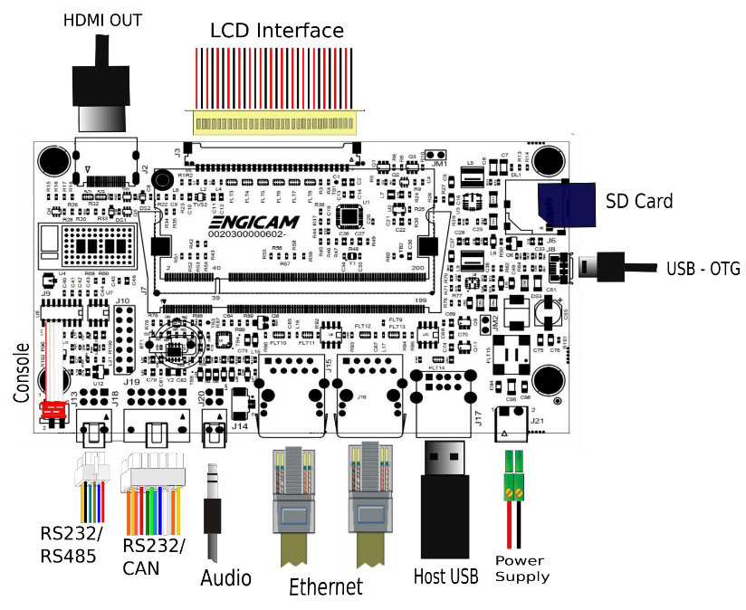

# Test sheet i.Core MX8M Mini C.TOUCH 3.1

## Test sheet

## Version: 1.0

## Preliminary

Creation of engicam-evaluation-image-mx8 image for sdcard booting and same image for eMMC programming.

--------------------------------------------------------------------------------------------------------

## Board Type: C.TOUCH 3.1

## SOM Type: i.Core MX8M Mini



--------------------------------------------------------------------------------------------------------

## U-boot tests

|                                       Test                                    | Status  |
|-------------------------------------------------------------------------------|---------|
| [eMMC Enviroment saving](#emmc-environment-saving)                            |   OK    |
| [Sdcard Enviroment saving](#sdcard-environment-saving)                        |   OK    |
| [Ethernet](#ethernet)                                                         |   OK    |
| [Boot from eMMC](#boot-from-emmc)                                             |   OK    |
| [Boot from sdcard](#boot-from-sdcard)                                         |   OK    |
| [USB](#usb)                                                                   |   OK    |
| [Serial Download](#serial-download)                                           |   OK    |

## Test Notes:

### eMMC Environment saving

```bash
setenv serverip 192.168.2.93
saveenv
reset board
printenv serverip
```

### Sdcard environment saving

Close the connector JM1:

```bash
setenv serverip 192.168.2.93
saveenv
reset board
printenv serverip
```

### Ethernet

Once the serverip has been saved:

```bash
setenv ipaddr 192.168.2.70
ping 192.168.2.161
```

The output should be:

```bash
Using ethernet@30bf000 device
host 192.168.2.161 is alive
```

### Boot from eMMC

Open the connector JM1:

```bash
saveenv
```

The output should be:

```bash
Saving Environment to MMC... Writing to MMC(2)... OK
```

### Boot from sdcard

Close the connector JM1:

```bash
saveenv
```

The output should be:

```bash
Saving Environment to MMC... Writing to MMC(1)... OK
```

### USB

Plug USB storage devices in J17:

```bash
usb start
```

The output should be:

```bash
starting USB...
Bus usb@38200000: Register 2000140 NbrPorts 2
Starting the controller
USB XHCI 1.10
scanning bus usb@38200000 for devices... 4 USB Device(s) found
       scanning usb for storage devices... 2 Storage Device(s) found
```

```bash
usb tree
```

The output should be (for example):

```bash
  1  Hub (5 Gb/s, 0mA)
  |  U-Boot XHCI Host Controller 
  |
  +-2  Hub (480 Mb/s, 2mA)
    |
    +-3  Mass Storage (480 Mb/s, 100mA)
    |    Lexar USB Flash Drive AAGQFTGHNCK9GDXE
    |  
    +-4  Mass Storage (480 Mb/s, 200mA)
         Verbatim STORE N GO 072125AD020B8F58
```

Once done do:

```bash
usb stop
```

```bash
stopping USB..
```

to safely remove storage devices.

### Serial Download

Close JM2 and keep JM1 open to enable serial download. Connect
the board with the source machine (i.e. the machine you are
downloading the images from) by using the board's OTG header (J8).

Power on the board.

From source machine check if an USB device for serial download
is detected:

```bash
uuu -lsusb
```

Output:

```bash
uuu (Universal Update Utility) for nxp imx chips -- lib1.5.141

Connected Known USB Devices
	Path	 Chip	 Pro	 Vid	 Pid	 BcdVersion
	==================================================
	1:1	 MX865	 SDPS:	 0x1FC9	0x0146	 0x0002

```

Here we see a device is detected. Then type:

```bash
uuu -v -b emmc_all imx-boot engicam-evaluation-image-mx8-imx8mp-icore.rootfs.wic
```

And wait for the download and flash of eMMC to finish.

--------------------------------------------------------------------------------------------------------

## Kernel Linux tests

| Status |              Test             | Note
|--------|-------------------------------|--------------------------------
|   OK   |        Ethernet 0 (J14)       | see [note1](#note-1)
|   N/A  |        Ethernet 1 (J15)       | see [note1](#note-1)
|   OK   |          USB 2.0 (J17)        | tested with USB stick
|   OK   |      SD card (JM1 closed)     | boot system from SD card
|   OK   |      eMMC card (JM1 open)     | boot system from eMMC
|   TBT  |     UART 232 ttymxc0 (J19)    | see [note2](#note-2)
|   TBT  |     UART 485 ttymxc2 (J18)    | see [note3](#note-3)
|   OK   |      Linux Console (J13)      |
|   OK   |              WIFI             | see [note4](#note-4)
|   TBT  |           BLUETOOTH           | see [note5](#note-5)
|   OK   |              RTC              | see [note6](#note-6)
|   OK   |             Reboot            |
|   TBT  |          Audio (J20)          | see [note7](#note-7)
|   N/A  |           HDMI (J2)           |
|   N/A  |       CAN 0/CAN 1 (J19)       | see [note8](#note-8)

## With Yes 7"

| Status |              Test             | Note
|--------|-------------------------------|--------------------------------
|   OK   |             LVDS (J3)         | see [note9](#note-9)
|   OK   |           Backlight           | see [note10](#note-10)
|   OK   |          Touchscreen          | see [note11](#note-11)
|   OK   |              GPU              | see [note12](#note-12)
|   OK   |              VPU              | see [note13](#note-13)

--------------------------------------------------------------------------------------------------------

## Note

### Note 1

Connect board's ethernet with your machine's one.

On your machine launch iperf3 server by typing:

```bash
iperf3 -s
```

On board launch iperf3 in client mode:

```bash
iperf3 -c 192.168.10.1
```

Using the IP address of your server machine.

Output:

```bash
Connecting to host 192.168.10.1, port 5201
[  5] local 192.168.10.85 port 47390 connected to 192.168.10.1 port 5201
[ ID] Interval           Transfer     Bitrate         Retr  Cwnd
[  5]   0.00-1.00   sec  12.2 MBytes   103 Mbits/sec    0    188 KBytes       
[  5]   1.00-2.00   sec  11.1 MBytes  93.3 Mbits/sec    0    188 KBytes       
[  5]   2.00-3.00   sec  11.0 MBytes  92.3 Mbits/sec    0    188 KBytes       
[  5]   3.00-4.00   sec  11.5 MBytes  96.5 Mbits/sec    0    188 KBytes       
[  5]   4.00-5.00   sec  10.9 MBytes  91.2 Mbits/sec    0    188 KBytes       
[  5]   5.00-6.00   sec  11.2 MBytes  94.4 Mbits/sec    0    188 KBytes       
[  5]   6.00-7.00   sec  11.4 MBytes  95.4 Mbits/sec    0    188 KBytes       
[  5]   7.00-8.00   sec  10.9 MBytes  91.2 Mbits/sec    0    188 KBytes       
[  5]   8.00-9.00   sec  11.2 MBytes  94.4 Mbits/sec    0    188 KBytes       
[  5]   9.00-10.01  sec  11.2 MBytes  93.1 Mbits/sec    0    188 KBytes       
- - - - - - - - - - - - - - - - - - - - - - - - -
[ ID] Interval           Transfer     Bitrate         Retr
[  5]   0.00-10.01  sec   113 MBytes  94.7 Mbits/sec    0            sender
[  5]   0.00-10.03  sec   112 MBytes  94.1 Mbits/sec                  receiver

iperf Done.
```

### Note 2

Connect TX/RX PIN connector J11 to the UART 232 port
From terminal launch command:

```bash
test_serial ttymxc0
```

Verify that the characters written from keyboard are echoed in terminal.

### Note 3

Tested with other RS485 device connected with command:

```bash
test_serial2 -d /dev/ttymxc2 -b 115200
```

Be sure to launch the command test_serial2 on both devices to
see the communication between devices on the terminal:

```bash
Device = /dev/ttymxc2, Baudrate = 115200
Open Port
sent: [Test PACKETs 0#]
received: [Test PACKETs 0#]
sent: [Test PACKETs 1#]
received: [Test PACKETs 1#]
sent: [Test PACKETs 2#]
received: [Test PACKETs 2#]
sent: [Test PACKETs 3#]
received: [Test PACKETs 3#]
sent: [Test PACKETs 4#]
received: [Test PACKETs 4#]
...
```

### Note 4

Sample commands for wifi testing:

```bash
modprobe moal mod_para=nxp/wifi_mod_para.conf
ifconfig mlan0 up
iw dev mlan0 scan | grep SSID
wpa_passphrase SSID PASSWORD > /etc/wpa_supplicant.conf
wpa_supplicant -imlan0 -Dnl80211 -c/etc/wpa_supplicant.conf -B
udhcpc -imlan0
echo "nameserver 8.8.8.8" > /etc/resolv.conf
```

If you have rfkill enabled in kernel command `ifconfig mlan0 up`
may fail due to rfkill. Type:

```bash
rfkill
```

Example output:

```bash
ID TYPE      DEVICE    SOFT      HARD
 0 mlan      phy0   blocked unblocked
```

So type:

```bash
rfkill unblock 0
```

to unlock mlan.

Try to ping some machines and known sites.

### Note 5

Commands for bluetooth testing:

```bash
hciattach -b /dev/ttymxc3 any 3000000 flow
hciconfig hci0 up
hcitool scan
```

If you have rfkill enabled in kernel after the `hciconfig hci0 up` command
type:

```bash
rfkill
```

Example output:

```bash
ID TYPE      DEVICE    SOFT      HARD
 0 wlan      phy0   blocked unblocked
 1 bluetooth hci0   blocked unblocked
```

So type:

```bash
rfkill unblock 1
```

to unlock bluetooth.

###  Note 6

Set a time and date to the clock:

```bash
date -s "2000-01-01"
hwclock -w && sync
```

Turn off the system and power it back on. Once it booted check that the date is the same:

```bash
hwclock
```

### Note 7

Record an audio file with command:

```bash
arecord -d 5 -f S16_LE /tmp/test-mic.wav
```

then play and check with command:

```bash
aplay /tmp/test-mic.wav
```

### Note 8

Connect J19 header to another board CAN header and configure related can links
on both ends of the connection:

End A:

```bash
ip link set can0 type can bitrate 125000
```

End B (for example on other board, can1):

```bash
ip link set can1 type can bitrate 125000
```

Enable interfaces on both ends:

End A:

```bash
ifconfig can0 up
```

End B (for example on other board, can1):

```bash
ifconfig can1 up
```

Make End A listen:

```bash
cantest can0
```

Send a frame from End B:

```bash
cantest can1 5A1#11.2233.44556677.88
```

Check output on End A:

```bash
read 16 bytes
5A1  [8] 11 22 33 44 55 66 77 88
```

Do the same from B to A (make B listen and A send a frame).


### Note 9

Tested with command:

```bash
gst-launch-1.0 -v videotestsrc  ! capsfilter caps="video/x-raw, width=1024, height=600"  !  autovideosink
```

### Note 10

Tested with command:

```bash  
echo <n> > /sys/class/backlight/backlight/brightness
```

where n is an integer from 0 to 100

### Note 11

Tested with command:

```bash
evtest /dev/input/event0
```

### Note 12

Use benchmark tool Glmark2:

```bash
glmark2-es2-wayland
```

### Note 13

Commands for compressed file creation and playback.

#### Test vp8

```bash
gst-launch-1.0 videotestsrc ! video/x-raw, format=I420, width=640, height=480 ! vpuenc_vp8 ! matroskamux ! filesink location=file.mkv
gst-launch-1.0 filesrc location=file.mkv ! matroskademux ! queue ! vpudec ! queue ! waylandsink
```

#### Test h264

```bash
gst-launch-1.0 videotestsrc ! video/x-raw, format=I420, width=640, height=480 ! vpuenc_h264 ! filesink location=test.h264
gst-launch-1.0 filesrc location=test.h264 ! queue ! h264parse ! vpudec ! queue ! waylandsink
```
