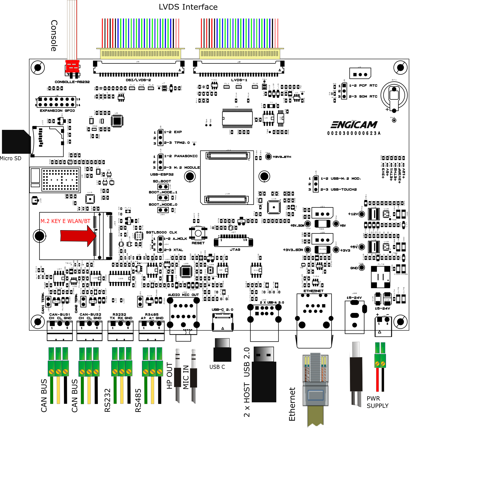

# Test sheet MicroGEA MX91 + MicroGEA Evaluation Board

## Test sheet

## Version: 1.0

## Preliminary

Creation of engicam-evaluation-image-mx91 image for sdcard booting and same image for eMMC programming.

--------------------------------------------------------------------------------------------------------

## Board Type: MicroGEA Evaluation Board

## SOM Type: MicroGEA MX91



--------------------------------------------------------------------------------------------------------

## U-boot tests

|                                       Test                                    | Status  |
|-------------------------------------------------------------------------------|---------|
| [eMMC Enviroment saving](#emmc-environment-saving)                            |   OK    |
| [Sdcard Enviroment saving](#sdcard-environment-saving)                        |   OK    |
| [Ethernet](#ethernet)                                                         |   OK    |
| [Boot from eMMC](#boot-from-emmc)                                             |   OK    |
| [Boot from sdcard](#boot-from-sdcard)                                         |   OK    |
| [USB](#usb)                                                                   |   OK    |
| [Serial Download](#serial-download)                                           |   TBT   |

## Test Notes:

### eMMC Environment saving

```bash
setenv serverip 192.168.2.93
saveenv
reset board
printenv serverip
```

### Sdcard environment saving

Close the connector JM1:

```bash
setenv serverip 192.168.2.93
saveenv
reset board
printenv serverip
```

### Ethernet

Once the serverip has been saved:

```bash
setenv ipaddr 192.168.2.70
ping 192.168.2.161
```

The output should be:

```bash
Using ethernet@30bf000 device
host 192.168.2.161 is alive
```

### Boot from eMMC

Open the connector JM1:

```bash
saveenv
```

The output should be:

```bash
Saving Environment to MMC... Writing to MMC(2)... OK
```

### Boot from sdcard

Close the connector JM1:

```bash
saveenv
```

The output should be:

```bash
Saving Environment to MMC... Writing to MMC(1)... OK
```

### USB

Plug USB storage devices in J33 connectors (J35 is
not enabled in u-boot for USB bus 0 is in peripheral
mode for OTG serial download):

```bash
usb start
```

The output should be:

```bash
starting USB...
Bus usb@4c100000: Port not available.
Bus usb@4c200000: USB EHCI 1.00
scanning bus usb@4c200000 for devices... 4 USB Device(s) found
       scanning usb for storage devices... 2 Storage Device(s) found
```

```bash
usb tree
```

The output should be (for example):

```bash
USB device tree:
  1  Hub (480 Mb/s, 0mA)
  |  u-boot EHCI Host Controller 
  |
  +-2  Hub (480 Mb/s, 2mA)
    |
    +-3  Mass Storage (480 Mb/s, 100mA)
    |    Lexar USB Flash Drive AAGQFTGHNCK9GDXE
    |  
    +-4  Mass Storage (480 Mb/s, 200mA)
         Verbatim STORE N GO 072125AD020B8F58
```

Once done do:

```bash
usb stop
```

```bash
stopping USB..
```

to safely remove storage devices.

### Serial Download

Close J17 and J20 jumpers and open J16 to enable serial download.
Connect the board with the source machine (i.e. the machine you
are downloading the images from) by using the board's USB type C
OTG header (J35).

Power on the board.

From source machine check if an USB device for serial download
is detected:

```bash
uuu -lsusb
```

Output:

```bash
uuu (Universal Update Utility) for nxp imx chips -- lib1.5.141

Connected Known USB Devices
	Path	 Chip	 Pro	 Vid	 Pid	 BcdVersion
	==================================================
	1:1	 MX865	 SDPS:	 0x1FC9	0x0146	 0x0002

```

Here we see a device is detected. Then type:

```bash
uuu -v -b emmc_all imx-boot engicam-evaluation-image-mx93-imx91-microgea.rootfs.wic.zst/*
```

And wait for the download and flash of eMMC to finish.


--------------------------------------------------------------------------------------------------------

## Kernel Linux tests

| Status |              Test             | Note
|--------|-------------------------------|--------------------------------
|   OK   |        Ethernet 0 (J41)       | see [note1](#note-1)
|   OK   |         USB 2.0 (J33)         | tested with USB stick
|   OK   |      SD card (J16 closed)     | boot system from SD card
|   OK   |      eMMC card (J16 open)     | boot system from eMMC
|   OK   |      UART 232 ttyLP1 (J38)    | see [note2](#note-2)
|   OK   |      UART 485 ttyLP4 (J39)    | see [note3](#note-3)
|   OK   |        Linux Console (J3)     |
|   OK   |              WIFI             | see [note4](#note-4)
|   OK   |           BLUETOOTH           | see [note5](#note-5)
|   OK   |              RTC              | see [note6](#note-6)
|   OK   |            Reboot             |
|   OK   |         Reboot button         |
|   OK   |              LVDS             | see [note7](#note-7)
|   OK   |           Backlight           | see [note8](#note-8)
|   OK   |          Touchscreen          | see [note9](#note-9)
|   OK   |             Audio             | see [note10](#note-10)
|   OK   |          CAN 0 (J36)          | see [note11](#note-11)
|   TBT  |         PCIe (KEY E)          | see [note12](#note-12)

--------------------------------------------------------------------------------------------------------

## Note

### Note 1

Connect board's ethernet with your machine's one.

On your machine launch iperf3 server by typing:

```bash
iperf3 -s
```

On board launch iperf3 in client mode:

```bash
iperf3 -c 192.168.10.1
```

Using the IP address of your server machine.

Output:

```bash
Connecting to host 192.168.10.1, port 5201
[  5] local 192.168.10.85 port 47390 connected to 192.168.10.1 port 5201
[ ID] Interval           Transfer     Bitrate         Retr  Cwnd
[  5]   0.00-1.00   sec  12.2 MBytes   103 Mbits/sec    0    188 KBytes
[  5]   1.00-2.00   sec  11.1 MBytes  93.3 Mbits/sec    0    188 KBytes
[  5]   2.00-3.00   sec  11.0 MBytes  92.3 Mbits/sec    0    188 KBytes
[  5]   3.00-4.00   sec  11.5 MBytes  96.5 Mbits/sec    0    188 KBytes
[  5]   4.00-5.00   sec  10.9 MBytes  91.2 Mbits/sec    0    188 KBytes
[  5]   5.00-6.00   sec  11.2 MBytes  94.4 Mbits/sec    0    188 KBytes
[  5]   6.00-7.00   sec  11.4 MBytes  95.4 Mbits/sec    0    188 KBytes
[  5]   7.00-8.00   sec  10.9 MBytes  91.2 Mbits/sec    0    188 KBytes
[  5]   8.00-9.00   sec  11.2 MBytes  94.4 Mbits/sec    0    188 KBytes
[  5]   9.00-10.01  sec  11.2 MBytes  93.1 Mbits/sec    0    188 KBytes
- - - - - - - - - - - - - - - - - - - - - - - - -
[ ID] Interval           Transfer     Bitrate         Retr
[  5]   0.00-10.01  sec   113 MBytes  94.7 Mbits/sec    0            sender
[  5]   0.00-10.03  sec   112 MBytes  94.1 Mbits/sec                  receiver

iperf Done.
```

### Note 2

Connect TX/RX PIN connector J21 to the UART 232 port
From terminal launch command:

```bash
test_serial ttyLP7
```

Verify that the characters written from keyboard are echoed in terminal.

### Note 3

Tested with other RS485 device connected with command:

```bash
test_serial2 -d /dev/ttyLP4 -b 115200
```

Be sure to launch the command test_serial2 on both devices to
see the communication between devices on the terminal:

```bash
Device = /dev/ttyLP4, Baudrate = 115200
Open Port
sent: [Test PACKETs 0#]
received: [Test PACKETs 0#]
sent: [Test PACKETs 1#]
received: [Test PACKETs 1#]
sent: [Test PACKETs 2#]
received: [Test PACKETs 2#]
sent: [Test PACKETs 3#]
received: [Test PACKETs 3#]
sent: [Test PACKETs 4#]
received: [Test PACKETs 4#]
...
```

### Note 4

Close jumper J12 on position 1-2 before boot to enable
pan9028 Wifi/BT module or close it on position 2-3 to enable
PCIe Wifi/BT module.
 
Sample commands for wifi testing:

```bash
modprobe moal mod_para=nxp/wifi_mod_para.conf
ifconfig mlan0 up
iw dev mlan0 scan | grep SSID
wpa_passphrase SSID PASSWORD > /etc/wpa_supplicant.conf
wpa_supplicant -imlan0 -Dnl80211 -c/etc/wpa_supplicant.conf -B
udhcpc -imlan0
```

### Note 5

Close jumper J12 on position 1-2 before boot to enable
pan9028 Wifi/BT module or close it on position 2-3 to enable
PCIe Wifi/BT module.

Commands for bluetooth testing:

```bash
hciattach -b /dev/ttyLP3 any 3000000 flow
hciconfig hci0 up
hcitool scan
```

###  Note 6

Set a time and date to the clock:

```bash
date -s "2000-01-01"
hwclock -w && sync
```

Turn off the system and power it back on. Once it booted check that the date is the same:

```bash
hwclock
```

### Note 7

Type:

```
chvt 7
```

to show weston, if not visible. Then:

```bash
gst-launch-1.0 -v videotestsrc  ! capsfilter caps="video/x-raw, width=1024, height=600"  !  autovideosink
```

### Note 8

Tested with command:

```bash  
echo <n> > /sys/class/backlight/backlight/brightness
```

where n is an integer from 0 to 100

### Note 9

Tested with command:

```bash
evtest /dev/input/event0
```

### Note 10

Record an audio file with command:

```bash
arecord -d 5 -f S16_LE /tmp/test-mic.wav
```

then play and check with command:

```bash
aplay /tmp/test-mic.wav
```

### Note 11

Connect J23 or J24 header to another board CAN header (or simply connect
together J23 and J24 on the same board) and configure related can links
on both ends of the connection:

End A:

```bash
ip link set can0 type can bitrate 125000
```

End B (for example on other board, can1):

```bash
ip link set can1 type can bitrate 125000
```

Enable interfaces on both ends:

End A:

```bash
ifconfig can0 up
```

End B (for example on other board, can1):

```bash
ifconfig can1 up
```

Make End A listen:

```bash
cantest can0
```

Send a frame from End B:

```bash
cantest can1 5A1#11.2233.44556677.88
```

Check output on End A:

```bash
read 16 bytes
5A1  [8] 11 22 33 44 55 66 77 88
```

Do the same from B to A (make B listen and A send a frame).
When done on same board the command sequence is:

```bash
ip link set can0 type can bitrate 125000
ip link set can1 type can bitrate 125000
ifconfig can0 up
ifconfig can1 up
cantest can0 &
cantest can1 5A1#11.2233.44556677.88
sleep 1
cantest can1 &
cantest can0 5A1#11.2233.44556677.88
```

### Note 12

Tested with SSD PCIe device. Check with lspci:

```bash
lspci
```

Output:

```bash
00:00.0 PCI bridge: Synopsys, Inc. DWC_usb3 / PCIe bridge (rev 01)
01:00.0 Non-Volatile memory controller: Transcend Information, Inc. NVMe PCIe SSD 110S/112S/120S/MTE300S/MTE400S/MTE652T2 (DRAM-less) (rev 03)
```

And with lsblk:

```bash
NAME         MAJ:MIN RM   SIZE RO TYPE MOUNTPOINTS
mmcblk2      179:0    0   7.3G  0 disk 
|-mmcblk2p1  179:1    0   256M  0 part 
`-mmcblk2p2  179:2    0   4.8G  0 part 
mmcblk2boot0 179:32   0     4M  1 disk 
mmcblk2boot1 179:64   0     4M  1 disk 
mmcblk1      179:96   0  29.1G  0 disk 
|-mmcblk1p1  179:97   0   256M  0 part 
`-mmcblk1p2  179:98   0   4.8G  0 part /
nvme0n1      259:0    0 119.2G  0 disk 
`-nvme0n1p1  259:1    0 119.2G  0 part 
```

Try mounting on some point `/dev/nvme0n1p1` and do a
write and read test.
