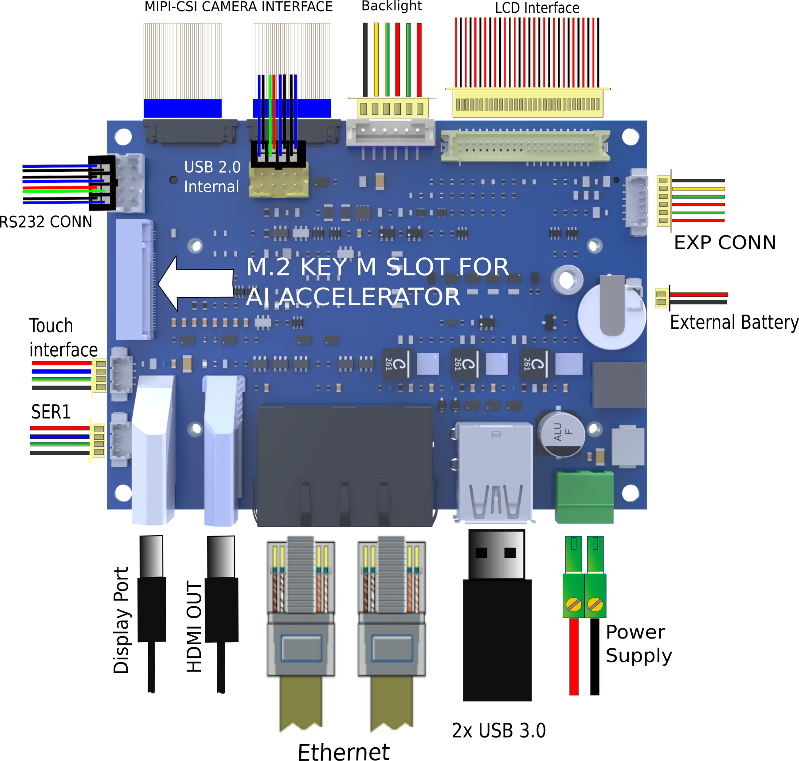

# Test sheet SmarCore MX95 Pico Board

## Test sheet

## Version: 1.0

## Preliminary

Creation of engicam-evaluation-image-mx95 image for booting eMMC programming.

--------------------------------------------------------------------------------------------------------

## Board Type: Smarcore Evaluation Board

## SOM Type: SmarCore MX95



--------------------------------------------------------------------------------------------------------

## U-boot tests

|                                       Test                    | Status  |
|---------------------------------------------------------------|---------|
| [eMMC Enviroment saving](#emmc-environment-saving)            |   OK    |
| [Ethernet](#ethernet)                                         |   OK    |
| [Boot from eMMC](#boot-from-emmc)                             |   OK    |
| [USB](#usb)                                                   |   OK    |
| [Serial Download](#serial-download)                           |   OK    |

## Test Notes:

### eMMC Environment saving

```bash
setenv serverip 10.24.67.70
saveenv
reset board
printenv serverip
```

### Ethernet

Once the serverip has been saved connect the board
at J17-A:

```bash
setenv ipaddr 10.24.67.70
ping 10.24.67.1
```

The output should be:

```bash
Using enetc-0 device
host 10.24.67.1 is alive
```

Do the same test on port J17-B. The output should be:

```bash
Using enetc-1 device
host 10.24.67.1 is alive
```

### Boot from eMMC

All switches positioned on OFF:

```bash
saveenv
```

The output should be:

```bash
Saving Environment to MMC... Writing to MMC(0)... OK
```

### USB

Plug USB storage devices in J18 UP connectors:

```bash
usb start
```

The output should be:

```bash
starting USB...
Bus usb@4c100000: Register 2000140 NbrPorts 2
Starting the controller
USB XHCI 1.10
Bus usb@4c200000: USB EHCI 1.00
scanning bus usb@4c100000 for devices... 1 USB Device(s) found
scanning bus usb@4c200000 for devices... 3 USB Device(s) found
       scanning usb for storage devices... 1 Storage Device(s) found
```

```bash
usb tree
```

The output should be (for example):

```bash
 usb tree
USB device tree:
  1  Hub (5 Gb/s, 0mA)
     U-Boot XHCI Host Controller

  1  Hub (480 Mb/s, 0mA)
  |  u-boot EHCI Host Controller
  |
  +-2  Hub (480 Mb/s, 2mA)
    |
    +-3  Mass Storage (480 Mb/s, 100mA)
         2199 Intenso Rainbow Line 3727090AF7721E8512744
```

Once done do:

```bash
usb stop
```

```bash
stopping USB..
```

to safely remove storage devices.

### Serial Download

```
USE SMARCORE EVB
```

Close switch 4 to enable serial download. Connect
the board with the source machine (i.e. the machine you are
downloading the images from) by using the board's OTG header (N/A).

Power on the board.

From source machine check if an USB device for serial download
is detected:

```bash
uuu -lsusb
```

Output:

```bash
uuu (Universal Update Utility) for nxp imx chips -- lib1.5.141

Connected Known USB Devices
        Path     Chip    Pro     Vid     Pid     BcdVersion      Serial_no
        ====================================================================
        3:344    MX95    SDPS:   0x1FC9 0x015D   0x0002  1E0751C8AA2342A8

```

Here we see a device is detected. Then type:

```bash
uuu -v -b emmc_all imx-boot engicam-evaluation-image-mx95-imx95-smarcore.rootfs.wic
```

And wait for the download and flash of eMMC to finish.

--------------------------------------------------------------------------------------------------------

## Kernel Linux tests

| Status |              Test             | Note
|:------:|:-----------------------------:|--------------------------------
|   OK   |        Ethernet 0 (J17-A)       | see [note1](#note-1)
|   OK   |        Ethernet 1 (J17-B)       | see [note1](#note-1)
|   OK   |          USB 2.0 (J8)           | tested with USB stick
|   OK   |          USB 3.0 (J18)          | tested with USB stick 
|   OK   |           eMMC card             | boot system from eMMC
|   OK   |      UART 232 ttyLP4  (J7)      | see [note2](#note-2)
|   OK   |         Linux Console (J14)     |
|   OK   |              WIFI               | see [note3](#note-3)
|   OK   |           BLUETOOTH             | see [note4](#note-4)
|   OK   |              RTC                | see [note5](#note-5)
|   OK   |            Reboot               |
|   OK   |             LVDS                | 
|   OK   |           Backlight             | see [note6](#note-6)
|   OK   |          Touchscreen            | see [note7](#note-7)
|   OK   |             HDMI                |
|   OK   |      M.2 Key M PCIe (J10)       | see [note8](#note-8)


--------------------------------------------------------------------------------------------------------

## Note

### Note 1

Connect board's ethernet with your machine's one.

On your machine launch iperf3 server by typing:

```bash
iperf3 -s
```

On board launch iperf3 in client mode:

```bash
iperf3 -c 192.168.10.1
```

Using the IP address of your server machine.

Output:

```bash
Connecting to host 192.168.10.1, port 5201
[  5] local 192.168.10.85 port 47390 connected to 192.168.10.1 port 5201
[ ID] Interval           Transfer     Bitrate         Retr  Cwnd
[  5]   0.00-1.00   sec  12.2 MBytes   103 Mbits/sec    0    188 KBytes       
[  5]   1.00-2.00   sec  11.1 MBytes  93.3 Mbits/sec    0    188 KBytes       
[  5]   2.00-3.00   sec  11.0 MBytes  92.3 Mbits/sec    0    188 KBytes       
[  5]   3.00-4.00   sec  11.5 MBytes  96.5 Mbits/sec    0    188 KBytes       
[  5]   4.00-5.00   sec  10.9 MBytes  91.2 Mbits/sec    0    188 KBytes       
[  5]   5.00-6.00   sec  11.2 MBytes  94.4 Mbits/sec    0    188 KBytes       
[  5]   6.00-7.00   sec  11.4 MBytes  95.4 Mbits/sec    0    188 KBytes       
[  5]   7.00-8.00   sec  10.9 MBytes  91.2 Mbits/sec    0    188 KBytes       
[  5]   8.00-9.00   sec  11.2 MBytes  94.4 Mbits/sec    0    188 KBytes       
[  5]   9.00-10.01  sec  11.2 MBytes  93.1 Mbits/sec    0    188 KBytes       
- - - - - - - - - - - - - - - - - - - - - - - - -
[ ID] Interval           Transfer     Bitrate         Retr
[  5]   0.00-10.01  sec   113 MBytes  94.7 Mbits/sec    0            sender
[  5]   0.00-10.03  sec   112 MBytes  94.1 Mbits/sec                  receiver

iperf Done.
```

### Note 2

Connect TX/RX PIN connector J14 to the UART 232 port
From terminal launch command:

```bash
test_serial ttyLP4
```

Verify that the characters written from keyboard are echoed in terminal.


### Note 3

```bash
ifconfig wlan0 up
iw dev wlan0 scan | grep SSID
wpa_passphrase SSID PASSWORD > /etc/wpa_supplicant.conf
sdcsupp -iwlan0 -Dnl80211 -c/etc/wpa_supplicant.conf -B
udhcpc -iwlan0
```

### Note 4

```bash
echo "1" > /sys/kernel/debug/ieee80211/phy0/cc33xx/ble_enable
hciconfig -a
hciconfig hci0 up
hciconfig -a
hciconfig hci0 up
[bluetooth]# scan on
```

###  Note 5

Set a time and date to the clock:

```bash
date -s "2026-08-18 16:16:00"
hwclock -w -f /dev/rtc0
```

Turn off the system and power it back on. Once it booted check that the date is the same:

```bash
hwclock -r -f /dev/rtc0
```

### Note 6

Tested with command:

```bash  
echo <n> > /sys/class/backlight/backlight/brightness
```

where n is an integer from 0 to 100

### Note 7

Tested with command:

```bash
evtest /dev/input/event1
```

### Note 8

```bash
lspci
```
